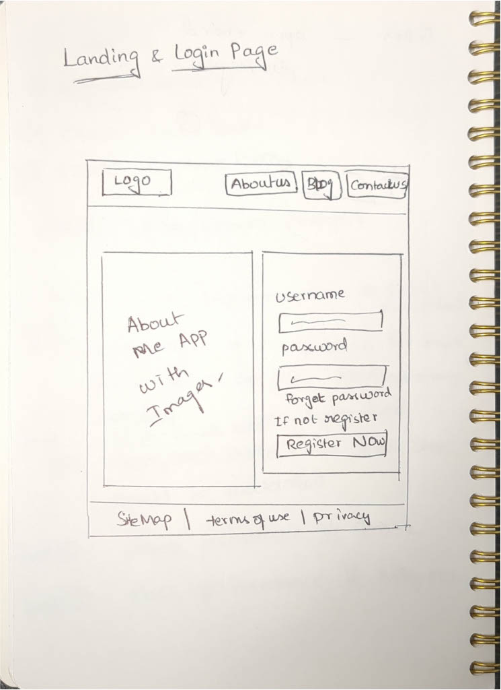
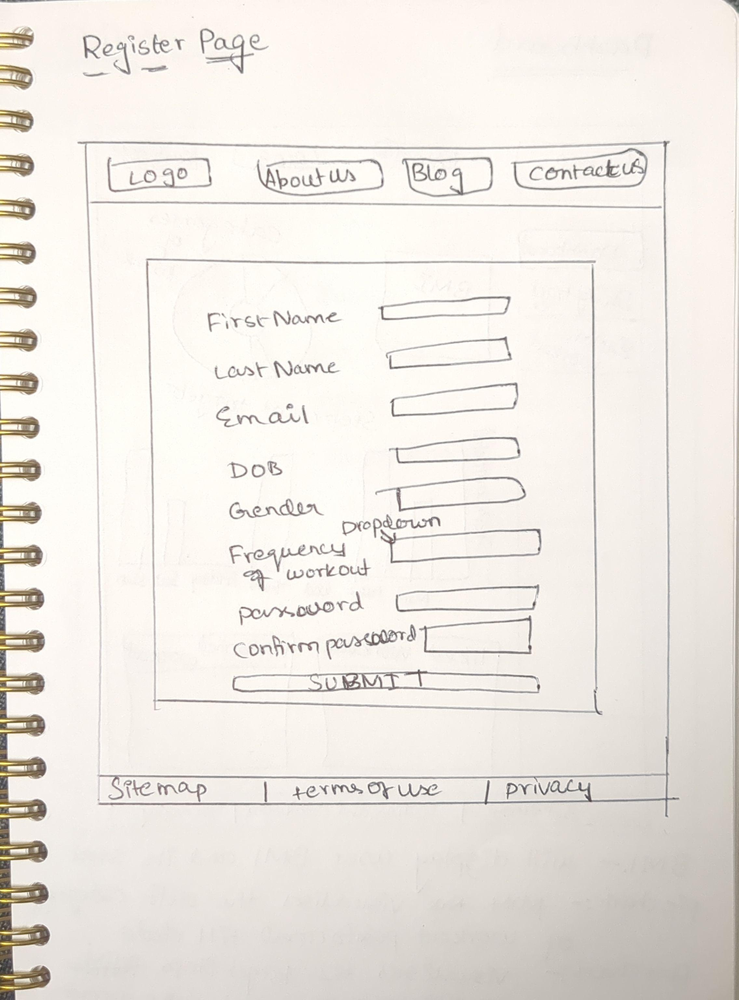
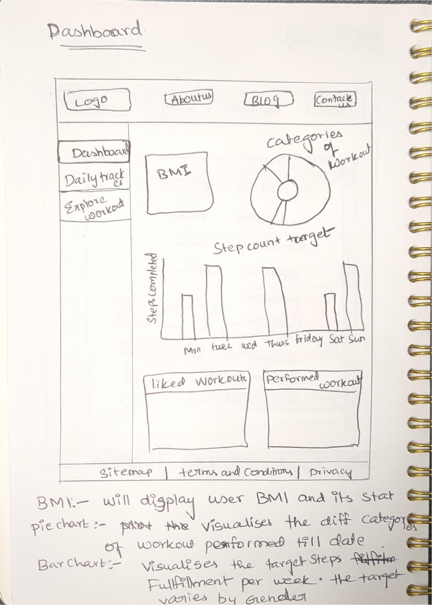
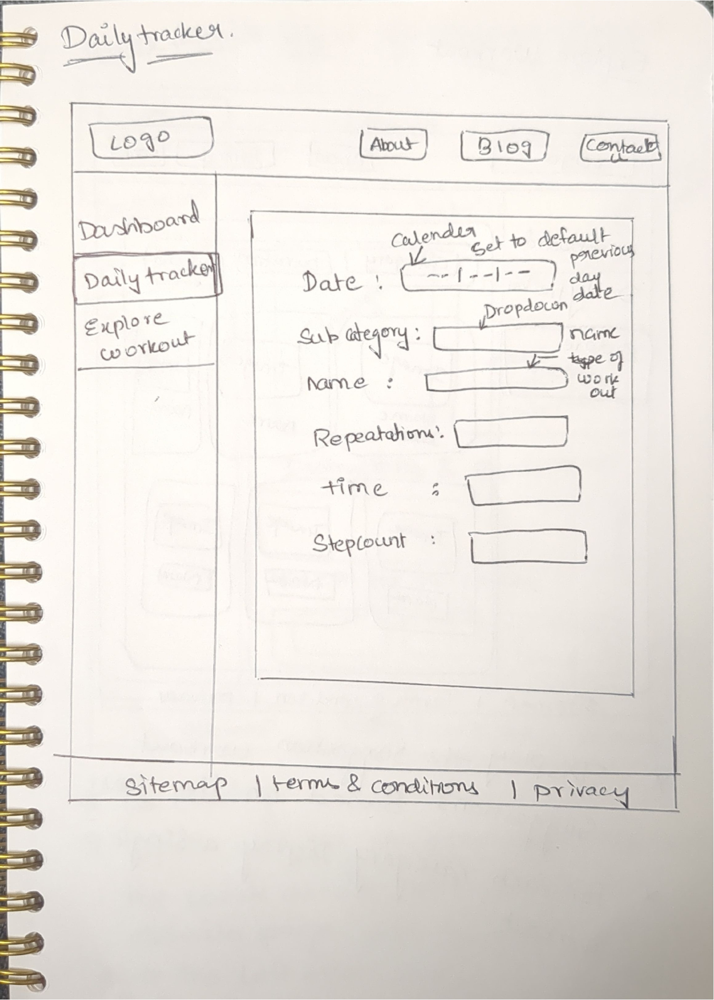
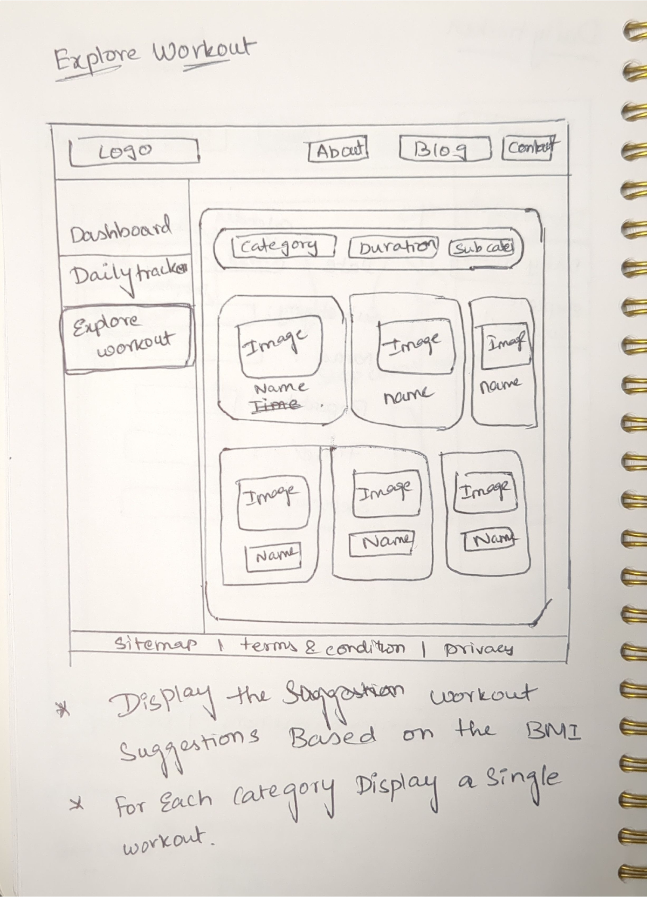
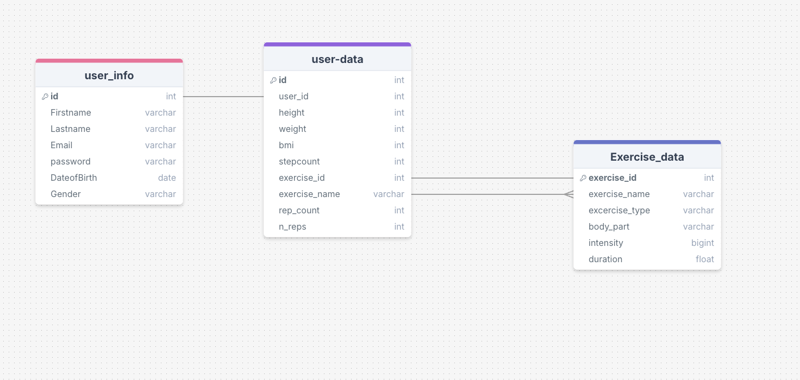

[!NOTE] PLease Check Develop Branch for Updated Version
# Project Title

WorkoutWise

## Overview

WorkoutWise is a personalized workout tracking and recommendation app that tailors new workout suggestions based on users' vital information and fitness goals.

### Problem Space

My application helps users achieve an optimal BMI by incorporating a daily tracker for their physical activities and monitoring long-term progress. It provides personalized workout recommendations to support their fitness journey effectively.

### User Profile

Fitness Enthusiast:

- Users aiming to maintain a healthy BMI and overall well-being.
- Individuals seeking to track their workout progress to monitor long-term improvements.
- Fitness enthusiasts looking to explore and incorporate new types of workouts into their routine.
- Users who want the ability to customize and manage their daily workout regimen effectively.

### Features

### **User Registration and Login Flow:**

- **As a New User:**

  - I should be able to register by clicking the "Register" button below the login form.
  - During registration, I should provide the following information: first name, last name, email, date of birth, gender, height, weight, preferred workout type, password, and confirm password.

- **As a Registered User:**
  - I should be able to log in to the application by entering my username and password.

---

### **Logged-in User Dashboard:**

- **As a Logged-in User:**

  - I should see my dashboard displaying:
    - Current BMI
    - Daily workout stats
    - Weekly step count stats for each day
    - A list of liked workouts
    - A record of previously performed workouts

- **Pop-up Notification:**

  - A pop-up should appear after logging in, indicating that I need to update my daily tracker with the latest data.

- **Navigation to Daily Tracker:**
  - I should be able to navigate to the "Daily Tracker" page by clicking the "Daily Tracker" option in the sidebar.
  - On the Daily Tracker page, I should be able to input my previous day's workout details.

---

### **Explore Workouts Page:**

- **As a User:**

  - I should be able to explore suggested workouts based on my vital information by clicking "Explore Workouts" in the sidebar.
  - I should be able to filter the workout list by:
    - Duration
    - Intensity
    - Name of the workout

- **Workout Details Page:**
  - On selecting a workout, I should be directed to a separate page displaying:
    - Detailed instructions
    - Duration and equipment required
    - Demo videos
    - An option to "Like" the workout
    - An option to "Add" the workout to my personalized workout regimen

## Implementation

### Tech Stack

- React
- TypeScript
- MySQL
- Express
- Client Libraries:
  - React
  - styled-components
  - react-router
  - axios
  - react-query
  - recharts
  - mui
  - formik
- Server Libraries
  - knex
  - Express
  - bcrypt
  - jsonwebtoken

### APIs

- No external APIs will be used for the first sprint

### Sitemap

- Landing page
  - login
  - Register
- Home Page or dashboard
- Daily Tracker Page
- Explore Workout Page
- Workout Details Page

### Mockups

Landing Page

- login

  

- Register

  

- dashboard

  

- daily Tracker

  

- explore workouts

  

### Data



### Endpoints

**POST /users/register**

- Add a new user account

Parameters:

- firstname: User's first Name
- lastname: User's last Name
- DOB: User's DOB
- Gender: User's Gender
- Workout Frequency per day in Number
- Email
- Password
- Confirm Password

Response:

```
{
  message: registered Sucessfully
}
```

**POST /users/login**

- Allow user to login if already Registered

Parameters:

- Email: user's email address during registration
- Password : user's password provided during registration

Response:

```
{
   "token": "seyJhbGciOiJIUzI1NiIsInR5cCI6IkpXVCJ9.eyJzdWIiOiIxMjM0NTY3ODkwIiwibmFtZSI6I..."
}
```

**GET /excercises**

- Get 10 records of Ecercises

Response:

```
[
{
 "excercise_id": 1,
 "excercise_name": '3/4 Sit-Up',
 "body-part": ["waist", "abs"],
 "intensity": 'medium',
 "duration": 20
},
{
"excercise_id": 4,
 "excercise_name": 'Alternate Heel Touchers',
 "body-part": ["abs"],
 "intensity": 'high',
 "duration": 20
}
]

```

**GET /excercises/:body-part**

- Filter workout based on the body part selected. If Waist selected

Response:

```
[
{
 "excercise_id": 1,
 "excercise_name": '3/4 Sit-Up',
 "body-part": ["waist"],
 "intensity": 'medium',
 "duration": 20
},
{
 "excercise_id": 7,
 "excercise_name": 'Air Bike',
 "body-part": ["waist"],
 "intensity": 'high',
 "duration": 15
}
]

```

**GET /excercises/:id**

- Get all the details of the Excercises By Id

Response:

```
{
  "excercise_id": 1,
  "excercise_name": "3/4 Sit-Up"
  "body_part": ["waist", "abs"],
  "intensity": "medium",
  "duration": 20,
  "imgUrl": "sample.jpg",
  "instructions": [
"Lie flat on your back with your knees bent and feet flat on the ground.",
"Place your hands behind your head with your elbows pointing outwards.",
"Engaging your abs, slowly lift your upper body off the ground, curling forward until your torso is at a 45-degree angle.",
"Pause for a moment at the top, then slowly lower your upper body back down to the starting position.",
"Repeat for the desired number of repetitions."],
"equipment": "no equipment required",
"reference-video-links": [sample-video-links],
}
```

**POST /daily-tracker**

- Allow user to post the previous day Excercise Information

Parameters:

- Yesterday Date
- Category of Workout
- Name of the Workout
- No of Repeations
- Duration
- Step Count

Response:

```
{
  "user_id": 1,
  "height": 125,
  "weight": 137,
  "bmi": 88,
  "stepCount": 12000,
  "excercise_id": 2,
  "excercise_name": "3/4 Sit-Up",
  "rep_count": 10
}
```

## Roadmap

**Milestone 1**

- Basic Setup

  - Create Server

    - express project with with routing all the dependecies installed
    - Create Migrations and seed
      - Excercise Table
        - Organize diverse workout categories into subcategories based on target body parts, along with detailed exercise information for each
      - User-info Table
        - Create a table according to Mock db diagram with dummy data
          -User-data Table
        - Create a Table according to Mock db Diagram with dummy data

  - Create Client
    - Setup react projects by installing all the basic dependencies required
    - Setup Routing and styling for the Application

**Milestone 2**

- Authentication

  - Server

    - Feature:
      - Create EndPoints for POST /users/login, POST /users/register
      - handle Authentication while creating post apis

  - Client
    - Feature:
      - Create Login Page UI and Ingegrate it with Created API
      - Create Register Page UI and Integrate it with Created API

**Milestone 3**

- Dashboard

  - Server
    - Feature:
      - Create Endpoints to get stepCount of the User for past one week
      - Create API to get User Data like BMI, Liked Excercises, Previous Performed Excercises etc
  - Client
    - Feature:
      - Create UI according to Mockup to Visualize the stepcount for a week
      - Create UI according to Mockup to Visualize the Categories of excercises Available and no of Sub Categories

**Milestone 4**

- explore Excercises

  - Server
    - Feature:
      - Create API to get all the categories of Excercises available
      - Filter Feature:
        - Create API to get the Exercise by duration, body part
  - Client
    - Feature:
      - Create UI according to mockup to display Excercises and add dropdown elements as filters to get Excercise by body part and duration.

**Milestone 5**

- Excercise Details

  - Server
    - Feature:
      - Create an API to get exercise details
  - Client
    - Feature:
      - Create a UI according to Mockup to display the details of the Excercises.

**Milestone 6**

- Daily Tracker

  - Server
    - Feature:
      - Create Endpoints to post the previous day Excercise information and no of steps taken
  - Client
    - Feature:
      - Create a Form UI in the daily Tracker Tab and integrate it with the dailyTracker endpoint

--- Bug Fixes

--- Demo

## Future Implementations

-- Calories Burned so far based on the History of Progress
-- Diet Plan Suggestion
-- Different Category Diets
-- Recipes Suggestion based on Category
